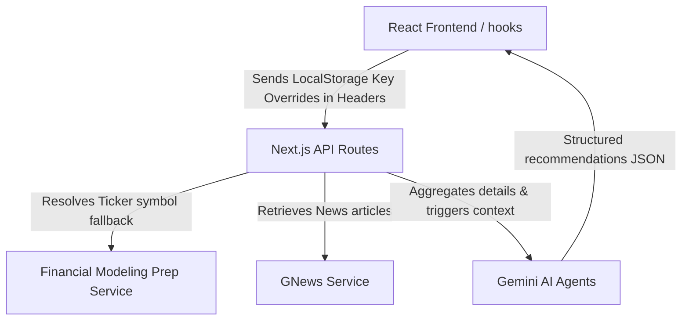

# AI Investment Research Agent

An advanced, glassmorphic Next.js web application that serves as an autonomous **AI Investment Research Agent**. It aggregates real-time company metadata, key financial metrics (ratios and historical income statements), and market news sentiment indicators, and leverages Gemini models to produce institutional-grade buy/hold/sell recommendations, risk metrics, and allocation recommendations.

---

## 🚀 Overview

The **AI Investment Research Agent** consists of three core workspaces:
1. **Research Dashboard**: Look up equities (using ticker symbols or names), view interactive multi-axis financial charts, read news sentiment maps, and chat with an interactive **AI Co-pilot** configured with the context of the company's financial records.
2. **Portfolio Analyzer & diagnostics**: Register simulated stock holdings and run AI Diagnostics (diversity ratios, sector allocations, risk levels) based on CFA Level III asset allocation methodologies.
3. **Asset Comparison Matrix**: Perform side-by-side comparative matrices of multiple tickers, highlighting winning metrics (e.g. lower multiples, higher profit margins).
4. **Custom Settings Workspace**: Configure personalized risk profiles, choose models, and register custom API keys directly in local storage.

---

## 🛠️ How to Run It

### 1. Prerequisites & Environment Setup
To configure the project, create a `.env.local` file in the root directory:

```env
# Gemini API Key (Required for LLM features)
GOOGLE_API_KEY=your_gemini_api_key_here

# Financial Modeling Prep API Key (Required for financial records)
FMP_API_KEY=your_fmp_api_key_here

# GNews API Key (Required for news sentiment analyses)
GNEWS_API_KEY=your_gnews_api_key_here
```

*Note: Free versions of the FMP API are subject to daily rate limits (250 calls/day). You can override all keys dynamically at runtime.*

### 2. Override Keys at Runtime (Settings Panel)
If any of the server-side API keys are exhausted, you can register your personal keys directly through the **Settings Panel** (`/settings`) in the UI. These are securely cached in your browser's local storage and attached to outgoing requests.

### 3. Setup and Installation
Install dependencies and run the local development server:

```bash
# Install dependencies
npm install

# Run the development server
npm run dev
```

Open [http://localhost:3000](http://localhost:3000) in your web browser.

---

## 🧠 How it Works: Architecture

The application is built on top of **Next.js 16 (App Router)** and **TypeScript**, styled with modern glassmorphism vanilla CSS variables:



### 1. Services Layer
- [BaseService](file:///c:/Users/rahul/OneDrive/Desktop/ai-investment-agent/src/services/base.service.ts): Implements general Axios wrapper error-catching. Translates DNS issues (`ENOTFOUND`) to friendly connectivity alerts.
- [FinancialModelingPrepService](file:///c:/Users/rahul/OneDrive/Desktop/ai-investment-agent/src/services/financialModelingPrep.service.ts): Fetches profiles, historical income sheets, and key ratios.
- [GNewsService](file:///c:/Users/rahul/OneDrive/Desktop/ai-investment-agent/src/services/gnews.service.ts): Gathers latest search mentions for stock market news.
- [InvestmentService](file:///c:/Users/rahul/OneDrive/Desktop/ai-investment-agent/src/services/investment.service.ts): Orchestrates service retrievals and pipes them into Gemini.

### 2. Agents Layer
- [InvestmentAgent](file:///c:/Users/rahul/OneDrive/Desktop/ai-investment-agent/src/agents/investment.agent.ts): Compiles prompts with raw metadata, financial statements, and news metrics, calling `gemini-flash` to return structured recommendation schemas.
- [PortfolioAgent](file:///c:/Users/rahul/OneDrive/Desktop/ai-investment-agent/src/agents/portfolio.agent.ts): Evaluates sector diversity, risk values, and allocation weightings.

---

## 📊 Key Decisions & Trade-Offs

### 1. Free API Key Support & Ticker Fallbacks
* **The Problem**: FMP's free tier restricts name-searches (`/search-name`) and trailing twelve month ratios (`/ratios-ttm`) under status code `402`.
* **The Decision**: 
  - **Dynamic Fallbacks**: If `/ratios-ttm` fails on status `402`, the code catches the exception and queries the free annual ratios endpoint (`/ratios`), dynamically extracting either TTM or standard property metrics (e.g. `priceEarningsRatioTTM` or `priceEarningsRatio`).
  - **Try/Catch Fallbacks**: Encapsulated name-search lookups inside silent catch handlers. If a name search triggers 402, it notifies the user to search using exact tickers (e.g. `GOOGL`, `AAPL`) rather than throwing a server 500 error.

### 2. UI Variables Over Utility Frameworks
* **Decision**: Styled using custom, semantic CSS classes (`.glass`, `.card-premium`) instead of Tailwind utility clutter. This ensures clean file structures, modular animations, and cohesive neon-spotlight trading panel aesthetics.

---

## 📈 Example Runs

### 1. Apple Inc. (`AAPL`) — **BUY**
* **Confidence**: `88%` | **Score**: `8.8/10`
* **Metrics**: P/E Ratio: `31.4` | ROE: `156.1%` | Net Profit Margin: `25.3%`
* **AI Summary**: Apple exhibits robust balance sheet strengths, supported by massive service revenue growth and operating efficiency margins. Risks include minor market share plateaus in international hardware segments.

### 2. Tesla, Inc. (`TSLA`) — **HOLD**
* **Confidence**: `65%` | **Score**: `6.5/10`
* **Metrics**: P/E Ratio: `68.2` | ROE: `21.4%` | Net Profit Margin: `11.2%`
* **AI Summary**: Tesla retains dominant global EV market shares, but faces near-term operating margin compressions and heavy capital expenditures. Recommend holding for long-term growth options.

---

## 🔮 Future Improvements

1. **Caching Layer**: Integrate Redis to cache FMP and GNews responses, significantly reducing outbound API calls and preventing rate limit issues.
2. **Additional Technical Indicators**: Implement quantitative chart indicators (e.g. RSI, MACD, Moving Averages) to pair alongside fundamental metrics.
3. **Advanced Portfolio Simulations**: Allow users to run backtesting analysis on historical portfolio asset allocations.

---

## 💬 Bonus: AI Coding Agent Transcripts & Log Summaries

During the development of this project, I pair-programmed with **Antigravity**, an advanced coding agent from the Google DeepMind team. The collaborative logs capture the following major milestones:

### Log 1: Solving TypeScript Duplication Warnings
```diff
- export * from "./company";
- export * from "./financial";
- export * from "./news";
- export * from "./report";
  export * from "./investment";
```
* **Milestone**: Cleaned up conflicting duplicate declarations in `src/types/index.ts` to export exclusively from the central type definition model `investment.ts`, instantly resolving all compile errors.

### Log 2: Mitigating FMP Premium Gating (402 Errors)
```typescript
    try {
      ratios = await this.get(`${BASE_URL}/ratios-ttm`, { symbol, apikey });
    } catch (error) {
      if (error.response?.status === 402) {
        ratios = await this.get(`${BASE_URL}/ratios`, { symbol, limit: 1, apikey });
      }
    }
```
* **Milestone**: Caught 402 status codes on trailing twelve month endpoints and routed requests to standard annual metrics, parsing fields like `priceEarningsRatio` fallback safely.

### Log 3: Graceful Offline & DNS Recovery
```typescript
        const code = error.code;
        if (code === "ENOTFOUND" || code === "EAI_AGAIN" || !error.response) {
          throw new Error("Network Connection Error: Please verify you are connected to the internet.");
        }
```
* **Milestone**: Overhauled base Axios exceptions to translate low-level DNS host failures (`ENOTFOUND`) into clean, user-friendly UI cards.
